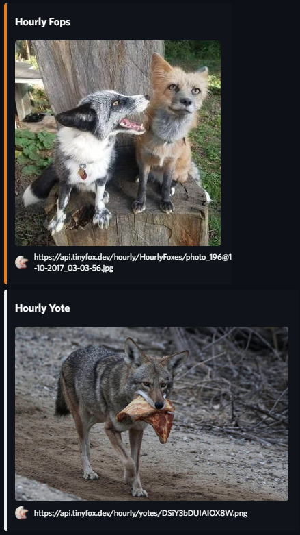

# Hourly Animals
## Get hourly posts of animals to your discord servers.
Thanks to tinyfox.dev for the API.
### Installation:
Use the files from the `src` folder and either ts-node or transpile to JavaScript.

### Discord preview:
  

### Command Line Interface:  
```
DiscordHourlyAnimals\src> ts-node --project tsconfig.json index.ts
[Pterodactyl] Ready
> help
add-webhook <url>
remove-webhook <url>
update-webhook <url> <animals[]>
list-webhooks
exit
> add-webhook https://discord.com/api/webhooks/9631----2897----38/Ni2D----XH6B----23Rt----BsIM----l35Y----Hw4Q----BzDk----Tv7Y----QtGc
Successfully added webhook.
> update-webhook https://discord.com/api/webhooks/9631----2897----38/Ni2D----XH6B----23Rt----BsIM----l35Y----Hw4Q----BzDk----Tv7Y----QtGc fox,yote
Successfully updated webhook.
> list-webhooks
9631----2897----38 9631----2897----38/Ni2D----XH6B----23Rt----BsIM----l35Y----Hw4Q----BzDk----Tv7Y----QtGc
> remove-webhook https://discord.com/api/webhooks/9631----2897----38/Ni2D----XH6B----23Rt----BsIM----l35Y----Hw4Q----BzDk----Tv7Y----QtGc
Successfully removed webhook.
> exit
```